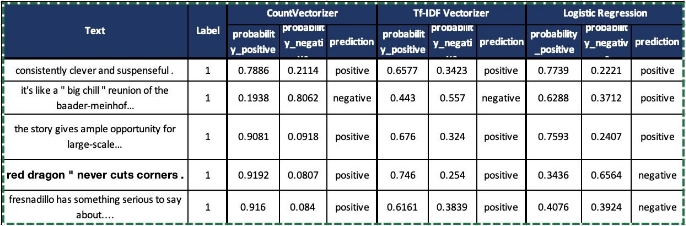

**CS 59000 – 05 Natural Language Processing Prof. Jonathan Russert** 

**Extra Credit Assignment - #1 Name: Mohamed Aarif Mohamed Sulaiman**  

**PFW ID: 900405565** 

**Methodology:** 

The methodology involved in this project is creating two functions namely, train\_NB\_model and test\_NB\_model for sentiment analysis purposes. Similar to the previous homework #3, instead of Logistic Regression model, we are using Naïve Bayes model for predicting the output. Also, instead of doing the feature extraction manually, we’re employing the pre-built libraries such as CountVectorizer and TfidfVectorizer. The same datasets of rotten tomatoes are used for this project as well and the procedures are similar. 

**train\_NB\_model:** 

The Naïve-Bayes model is trained using the extracted features from **CountVectorizer()** and  **TfidfVectorizer()**  function.  Now,  in  order  to  fine-tune  the  model  for  the  methods  of preprocessing,  we  are  implementing  a  grid  search  to  optimize  hyperparameters  along  with **MultinomialNB()**  classifier  (which  is  the  function  for  Naïve  Bayes).  This  will  involve  using **GridSearchCV** function from sklearn library which we have done in the previous homework. 

Now,  both  the  models  (**CountVectorizer()**  and  **TfidfVectorizer()**)  are  wrapped  in  a **Pipeline** function which allows for seamless integration of cross-validation and ensures that preprocessing is applied across all formats. For Parameter Grid functions, the following variables are used 

- Max\_features: This parameter controls the number of features (words) to consider. We have provided values 1000, 5000 and None. 
- Alpha: This is the smoothing parameter for the Naïve Bayes classifier, which helps handle zero probabili es. The values given are 0.5, 1.0 and 1.5. 

We find the grid search for both the models and get the best estimators after hyperparameter tuning. 

**test\_NB\_model:** 

Once the model is trained using best parameters, the model is tested using test dataset and it is evaluated using various parameters such as accuracy, precision, recall, F1 score, and a confusion matrix. These metrics provide a comprehensive view of the model's performance, allowing for insights into both the strengths and weaknesses of the predictions. 

**Evaluation Metrics & Interpretation:** 

**For CountVectorizer:** 

Accuracy: 0.7915 (or 79.15%) 

Precision: 0.8051 (or 80.51%) 

Recall: 0.7687 (or 76.87%) 

F1 Score: 0.7865 (or 78.65%) 

Confusion Matrix: [[434, 99],[123, 409]] 

- **True Posi ves (TP):** 409 instances were correctly predicted as posi ve.  
- **True Nega ves (TN):** 434 instances were correctly predicted as nega ve.  
- **False Posi ves (FP):** 99 instances were incorrectly predicted as posi ve (i.e., they were actually nega ve). 
- **False Nega ves (FN):** 123 instances were incorrectly predicted as nega ve (i.e., they were actually posi ve). 

**For TF-IDF Vectorizer:** 

Accuracy: 0.7906 (or 79.06%) 

Precision: 0.7954 (or 79.54%) 

Recall: 0.7819 (or 78.19%) 

F1 Score: 0.7886 (or 78.86%)  

Confusion Matrix: [[426, 107], [116, 416]] 

- **True Posi ves (TP):** 416 instances were correctly predicted as posi ve.  
- **True Nega ves (TN):** 426 instances were correctly predicted as nega ve.  
- **False Posi ves (FP):** 107 instances were incorrectly predicted as posi ve (i.e., they were actually nega ve). 
- **False Nega ves (FN):** 116 instances were incorrectly predicted as nega ve (i.e., they were actually posi ve). 

Both vectorization techniques yield similar overall performance, with Count Vectorizer slightly edging out in accuracy and precision, while TF-IDF shows better recall and a slightly higher F1 score. 

**Logistic Regression vs Naïve Bayes model’s performance:** 

|**Metrics** |**Logistic Regression** |**NB using Count Vectorizer** |**NB using TF-IDF** |
| - | :- | :-: | - |
|Accuracy |66\.57% |79\.15% |79\.06% |
|Precision |67\.25% |80\.51% |79\.54% |
|Recall |64\.85% |76\.87% |78\.19% |
|F1 score |66% |78\.65% |78\.86% |
|Confusion Matrix |[[366,167] , [189,343]] |[[434, 99],[123, 409]] |[[426, 107], [116, 416]] |

- The Logis c Regression model has a notable number of false posi ves (167) and false nega ves (189), indica ng that it misclassifies a significant number of texts. 
- The count of true posi ves (343) is lower than in both Naïve Bayes models, which means that the Logis c Regression model is less effec ve in iden fying posi ve sen ments.

**Potential Reasons for Differences:** 

1. **Feature Extrac on:** Logis c Regression’s feature engineering was basically done manually with many steps for increasing the precision, which is not present in the basic Count or TF-IDF vectoriza ons. 
1. **Hyperparameter  Tuning:**  Even  though  Logis c  Regression  is  adequately  tuned  using GridSearchCV , it lead to subop mal performance compared to the more straigh orward Naïve Bayes approach due to manual feature extrac on. 

**Output file comparison:** 

Let us randomly take five samples from the output file of CountVectorizer, TF-IDF and Logistic Regression. Here, notably three text inputs are wrongly predicted in Logistic Regression which is correctly identified by Naïve-Bayes. 

**Conclusion:** 

In conclusion, even though Logistic Regression is a powerful model in many scenarios, in this specific sentiment analysis task, it underperformed compared to Naïve Bayes classifiers. The latter demonstrated better accuracy, precision, recall, and F1 scores, highlighting its suitability for this type of text classification. 
